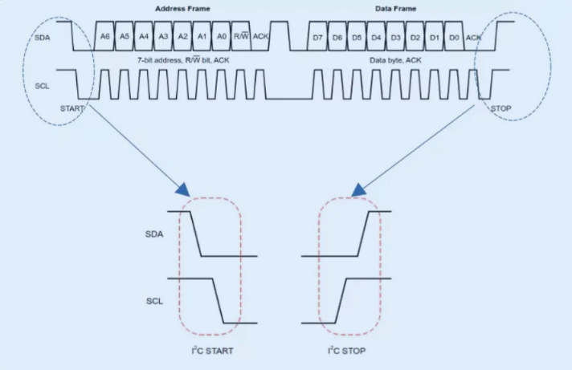
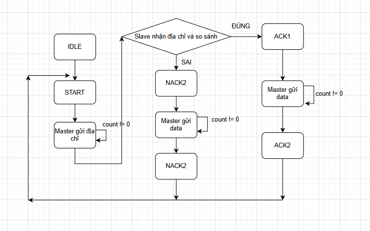
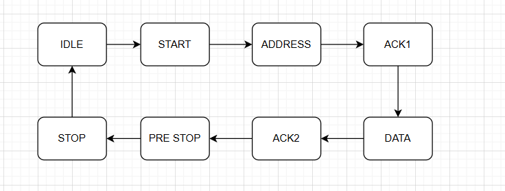
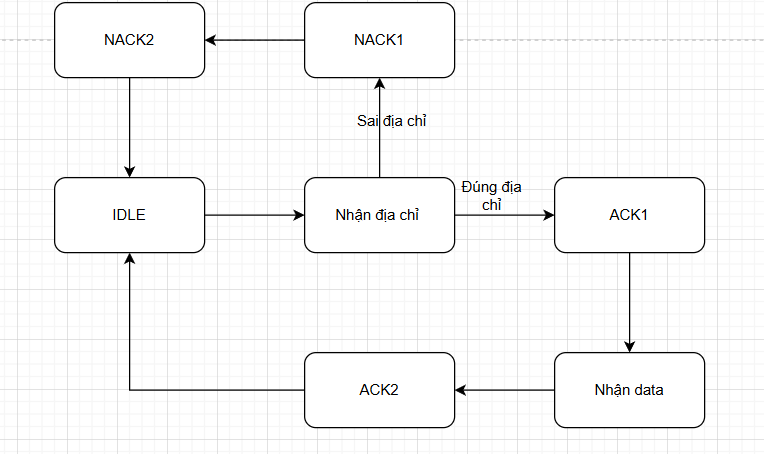
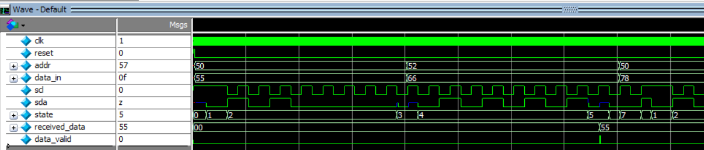

## I2C Write Protocol Implementation

This project implements **only the I2C write operation**, where the
**master actively drives the bus and transmits data**, and the
**slave operates in receive mode**.

The implementation focuses on the core I2C write transaction,
including START/STOP generation, address transmission with the write bit,
data transfer, and ACK handling, in accordance with the standard
**I2C specification**.

## Operating Principle

In the I2C protocol, all data transfers are synchronized by the clock line (SCL),
while the data line (SDA) is used to transmit address, control, and data bits.

A **START condition** is generated when the **SDA line is pulled low while SCL remains high**.
During data transmission, **SDA is allowed to change only when SCL is low**; SDA must
remain stable while SCL is high to ensure reliable data sampling.

The write transaction follows this sequence:
1. The **master transmits the slave address**, followed by the **Read/Write bit**  
   (R/W = 0 for write operation).
2. The **slave responds with an ACK or NACK** to indicate whether the address is accepted.
3. If acknowledged, the **master transmits the data byte** to the slave.
4. The **slave sends an ACK or NACK** to confirm successful data reception.

A **STOP condition** is generated when the **SDA line transitions from low to high
while SCL remains high**, indicating the end of the transaction and releasing the bus.

  
   
  <em>Figure 1. I2C START and STOP conditions</em>

  
   
  <em>Figure 2. I2C write message format</em>

An I2C write transaction consists of:
1. START condition  
2. 7-bit slave address + Write bit (R/W = 0)  
3. ACK from slave  
4. 7-bit data byte (MSB first)  
5. ACK from slave  
6. STOP condition
---

## Top-Level FSM

The top module implements a **finite state machine (FSM)** to control the
I2C write transaction, coordinating address transmission, data transfer,
and ACK/NACK handling between the master and the slave.

The FSM operates at the protocol level and controls the sequencing of
START, address, data, and STOP phases.

  
   
  <em>Figure 3. Top-level FSM for I2C write operation (Master write, Slave read)</em>

## MASTER FSM 

  
   
  <em>Figure 4. Master write</em>

With the STATE_ACK1: Waiting ACK from Slave after Master send address(SDA set to 1 - simulation don't really check ACK).

## SLAVE FSM 

  
   
  <em>Figure 5. Slave read</em>

## RESULT

  
   
  <em>Figure 6. top_tb</em>

From the waveform, the master first generates a START condition, then sends the
slave address with SLAVE_ADDR = 7'b1010000. After receiving an ACK from the slave,
the master transmits the data byte. Finally, the transaction ends with a STOP
condition, and the received data is marked as valid. 
